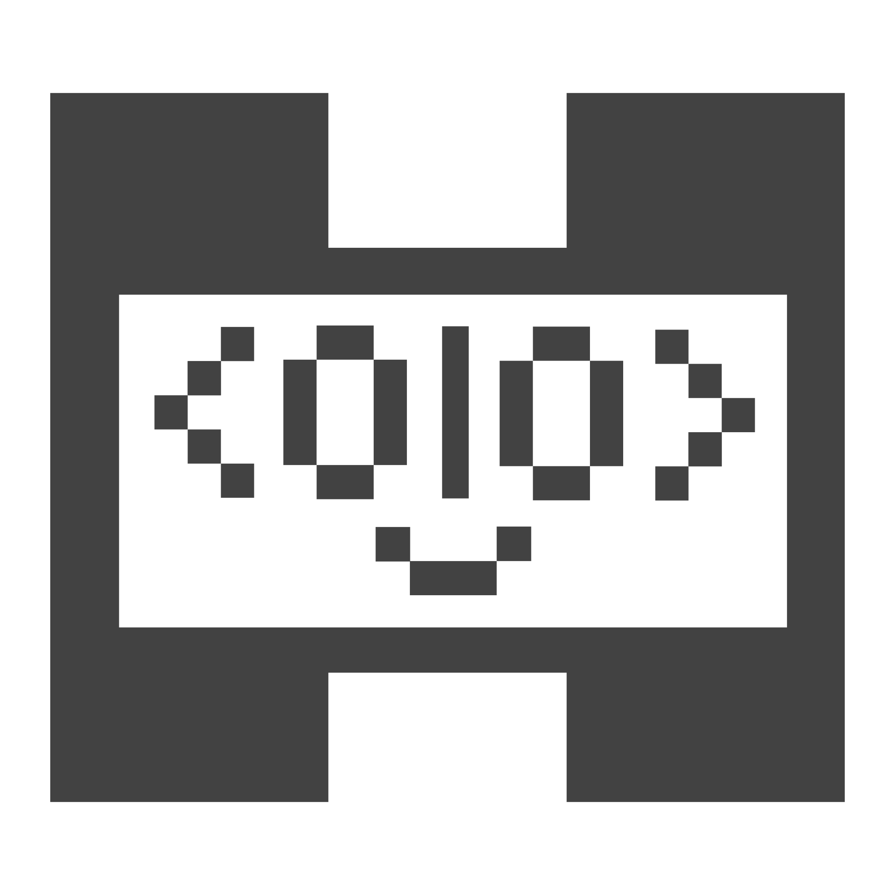

<div align="center">

<picture>
  <source media="(prefers-color-scheme: dark)" srcset="packages/extension/media/amico-face-dark.svg">
  
</picture>

# Amicode

### Open autonomous research, starting with quantum control.

Your vaults, your fleet, your devices, your pulses — composed by conversation.

<sub>A VS Code extension · built on [Piccolo.jl](https://github.com/harmoniqs/Piccolo.jl) · chat harness vendored from [opencode](https://github.com/sst/opencode) · model-agnostic — Kimi K3, Muse Spark, open models</sub>

</div>

---

Amicode is an **open autonomous research studio** that lives in your editor — **down to the hardware**.

Describe what you want in plain language — a gate, a state preparation, a calibration sweep — and Amicode designs the pulse, runs the solve, and shows you the result. Every run is captured, every pulse versioned for warm-start, and every session distilled into durable knowledge. The loop gets smarter as you use it.

Leveraging **Kimi K3** (Moonshot AI), **Muse Spark** (Meta), and other open models — on the open [opencode](https://github.com/sst/opencode) ecosystem (SST, vendored from `sst/opencode`). Model-agnostic by design: the loop, not the model, is the product.

We start with **quantum control** because it is the hardest physical system to prove the loop on. If the studio works here — arbitrary Hamiltonians, hard constraints, **hardware in the loop via Strumento.jl / QICK** — it generalizes to any physical system you can model. Bring your own Hamiltonian; the loop is the same. That's **physical intelligence**: not one device or platform, but a composable way to do experimental science. Plenty will sell you a closed “superintelligence” that never touches the hardware. We ship open, down to the RFSoC.

**This repo is the whole product:** the VS Code extension (`packages/extension`), the `amico` / `amico-run` CLI (`packages/amico-run`), and the public skill library (`packages/extension/skills/`) — skills are product content, versioned with the extension and bundled into every vsix. Additional skills load from your own vault mounts (never shipped), and package skills ride their Julia repos behind entitlements.

## The studio

**The workspace is what you edit. `~/.amico` is what the system manages. Amicode is the lens.**

Most of what used to clutter the workspace is not working material but state — visible only because a raw file tree was the only lens. Amicode replaces the tree with native surfaces:

| What the system manages | Where you see it |
|---|---|
| Vaults (`~/.amico/vaults/`) — notes, specs, experiment history | Vault tree + Armonia view |
| Runs (`~/.amico/runs/`) — per-solve capture | Run Inspector |
| Pulse catalog — versioned warm-start memory | Catalog view |
| Devices + calibration (`~/.amico/amicode/devices/`) | Device Inspector |
| Fleet + sessions — sync, locks, traces | Healthcheck, status bar, Learn |

The extension renders managed state semantically instead of exposing it as folders. The underlying files stay on disk and stay yours.

## What you get

### Open autonomous research

Amico, your research copilot, turns plain language into a self-contained Julia optimization, runs it, and streams the result back into native panels. Physics, solver idioms, and your lab's accumulated knowledge ride along as context — so the script it writes is correct by construction, not by luck. A short guided exchange settles anything it needs (levels, drive bounds, constraints) before committing to code. Every run is captured to disk and revisitable; when you beat a previous best, the catalog promotes and the next solve warm-starts from your last good answer.

### Open quantum intelligence

The physics ships with the tool. Platform references for **neutral-atom Rydberg**, **transmon**, **fluxonium**, **trapped-ion**, and **bosonic** systems load on demand — Hamiltonians, drive conventions, and construction patterns are inlined into each script so it stands alone. You never hand the assistant a Hamiltonian; naming the platform is enough. Searched papers, ingested notes, and your own experiment history plan alongside the physics.

### Vaults — your knowledge, mounted

Amicode reads your **vaults** — the stack you mount under `~/.amico/vaults/` (personal, team, project). Notes, specs, experiment history, and your pulse catalog become first-class context the assistant plans against. Armonia is one vault in that set — your personal research memory. Vaults layer by scope and by `visibility` (`local` → `team` → `public`); dream-promotion carries provenance so every insight traces to its source.

### Fleet management — one logical studio across machines

Your machines form one logical studio. Vault mounts sync via `armonia-sync-once` (launchd, every 15 min); the chat database stays canonical via an SSH mesh; WIP follows you between hosts with `leave`/`arrive`. No second writer ever touches the same SQLite file, no live `.git` is file-synced — the invariants are enforced, not assumed. Check it with `/fleet`; the skill is the playbook. Solo still works fully offline — the fleet simply means you never have to choose which machine holds the truth.

### Open system management — from pulse to device

The extension manages the system around the solve, not just the solve itself. Lab profiles (`lab.toml`), device calibration graphs, and run capture are all rendered natively instead of buried in config files. You see system state where you act on it.

### Down to the hardware — Strumento.jl + QICK

Amicode goes down to the hardware. [**Strumento.jl**](https://github.com/harmoniqs/Strumento.jl) (Julia) + [**strumento**](https://github.com/harmoniqs/strumento) (Python) bridge Amicode to RFSoC with a **coarse three-verb boundary** (`upload_pulse!` / `trigger!` / `readout`). All tProc-v2 specifics live board-side, so the firewall between you and the lab is just a transport. The same loop runs — and is tested — with **no Python and no board** via the built-in mock, then swaps to real hardware unchanged. Open sourcing soon. Our Fermilab collaboration ([news.fnal.gov](https://news.fnal.gov/2026/06/fermilab-and-harmoniqs-integrate-open-source-tools-to-advance-qubit-control-optimization/)) integrates open-source qubit-control optimization the same way — loop first, hardware second. Plenty will sell you a closed “superintelligence” that never touches the hardware. We build the open alternative.

## How it scales

```
solo ──────────► team ──────────► fleet

personal vault   + team / project    + SSH mesh, canonical DB,
local runs        vault mounts         WIP-sync, device locks
catalog           shared catalog       shared catalog, warm-starts
                  visibility-gated     every run feeds the next
                  dream-promotion
```

**Solo** — personal vault, local runs, versioned catalog. Works fully offline.

**Team** — mount team and project vaults alongside your personal one. Vaults layer with `local | team | public` visibility; promotion to the team vault is a PR with provenance, not a copy-paste. Two researchers never clobber: one-file-per-note, a computed catalog index, per-session result files, and device locks make concurrent work safe by construction.

**Fleet** — the mesh above. One canonical chat database, vault sync on a timer, WIP-sync across hosts. The same invariants that make team-safe make fleet-safe. Every run — whoever ran it, wherever — feeds the same knowledge base, so new work starts from the best prior answer.

## Skills are the product

Skills are not configuration — they are the capability surface. The **37 public skills** in `packages/extension/skills/` ship in the vsix, versioned with the product. Additional skills load from your own vault mounts and from co-located Julia packages behind entitlements.

| Surface | What it covers |
|---|---|
| Physics | `transmon`, `fluxonium`, `atoms` (Rydberg), `bosonic`, `ions` — Hamiltonians, drives, construction patterns |
| Lab + catalog + vault | `amico-lab`, `amico-catalog`, `amico-vault`, `amico-strategy`, `amico-schema-check` |
| Analysis + synthesis | `analyze`, `structural-analysis`, `hypothesis-review`, `dream-reflect` |
| System | `fleet`, `setup`, `solve`, `simulate`, `warm-start`, `constraints`, `objectives` |
| Delivery | `demo`, `pasqal`, `plot`, `compose`, `multistart` |
| Engineering | `debugging`, `tdd`, `verification`, `brainstorming`, `deliberate`, `grill-me`, `report-a-bug` |

The extension stages the union of the public bundle and your vault mounts at startup; mount presence is the eligibility proof.

## Physical intelligence

Quantum control is the first domain, not the ceiling. The studio's loop — *describe → author a self-contained optimization → run → capture → distill → warm-start the next run* — does not care what the Hamiltonian is, only that you can write it down. If you can model the system, the same vault, the same catalog, the same fleet carries the work. That's why we lead with the hardest physical system: if the loop is trustworthy here, it composes outward.

## Hardware — Strumento.jl / QICK / RFSoC

Amicode's hardware path is [**Strumento.jl**](https://github.com/harmoniqs/Strumento.jl) + [**strumento**](https://github.com/harmoniqs/strumento),
the QICK tProc-v2 framework (Julia face over Python device model / pulse IR / compiler). It bridges an optimized pulse to an RFSoC board over the same **coarse three-verb boundary** (`upload_pulse!` / `trigger!` / `readout`). All specifics live board-side, so the firewall between you and the lab is just a transport. The whole loop runs — and is tested — with **no Python and no board** via the built-in mock, then swaps to real hardware unchanged. Open sourcing soon.

> **Hardware backend & docs → [github.com/harmoniqs/Strumento.jl](https://github.com/harmoniqs/Strumento.jl) · [github.com/harmoniqs/strumento](https://github.com/harmoniqs/strumento) · Fermilab collab: [news.fnal.gov](https://news.fnal.gov/2026/06/fermilab-and-harmoniqs-integrate-open-source-tools-to-advance-qubit-control-optimization/)**

## Install

Search **Amicode** in the VS Code Extensions view, or grab a `.vsix` from
[Releases](https://github.com/harmoniqs/amicode/releases/latest).

Amicode runs on **Linux (x64 and arm64)** and **macOS (Apple Silicon)**. It runs wherever your
*workspace* lives, so on a remote it installs into that host's extension host, not your
laptop — pick the artifact for the **remote**, not for the machine running the VS Code
window.

**On Windows, use WSL.** There is no native Windows build; the chat harness Amicode
drives is built for Linux and macOS only. Open your project in WSL (**Remote — WSL**),
then install Amicode from the Extensions view *in that window* — VS Code installs it into
the WSL host, which is Linux. Installing into the Windows side instead gets you an
extension that activates and then tells you to do this.

To install a `.vsix` into WSL by hand, download and install it **from inside WSL** so it
lands in the WSL host rather than on Windows:

```bash
curl -fL -o /tmp/amicode.vsix \
  https://github.com/harmoniqs/amicode/releases/latest/download/amicode-linux-x64.vsix
code --install-extension /tmp/amicode.vsix
```

## Try it

Open the Amicode panel and paste:

> Design a minimum-time single-qubit X gate for a transmon (3 levels, penalize
> leakage to |2⟩). Then run the optimized pulse through the IntonatoQICK mock
> backend, read out the populations, and plot both the pulse and the readout.

This one prompt exercises the whole studio: it names a platform, a target, a constraint, and a hardware step — chat to physics skill to solve to mock readout to plot — without you writing the Piccolo API, the Hamiltonian, or the QICK verbs. Swap `transmon` for your own system and the loop is the same.

## Open core

The extension and its platform skills are open. **Entitled builds** add
Harmoniqs's proprietary capabilities — GPU-accelerated solvers and **closed-loop
hardware calibration** — unlocked by the packages you have access to. Same
editor, same workflow; what you can reach is set by your entitlements.

## Develop

```bash
pnpm install
pnpm run build      # esbuild → dist/extension.js
pnpm test           # vscode-shim smoke tests
```

See [`AGENTS.md`](./AGENTS.md) for the in-editor project conventions the extension
sets up.

---

<div align="center">
<sub>Built by <a href="https://harmoniqs.co">Harmoniqs</a> · quantum control, composed.</sub>
</div>
