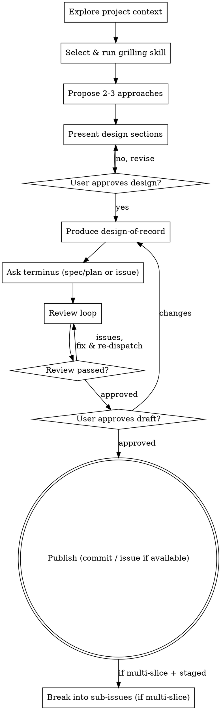

# Brainstorming Ideas Into Designs

Help turn ideas into fully formed designs and specs through natural collaborative dialogue.

Start by understanding the current project context, then run a grilling skill to reach shared understanding before designing. Once you understand what you're building, present the design and get user approval.

<HARD-GATE>
Do NOT invoke any implementation skill, write any code, scaffold any project, or take any implementation action until you have presented a design and the user has approved it. This applies to EVERY project regardless of perceived simplicity.
</HARD-GATE>

## Anti-Pattern: "This Is Too Simple To Need A Design"

Every project goes through this process. A todo list, a single-function utility, a config change — all of them. "Simple" projects are where unexamined assumptions cause the most wasted work. The design can be short (a few sentences for truly simple projects), but you MUST present it and get approval.

## Checklist

You MUST create a task for each of these items and complete them in order:

1. **Explore project context** — check files, docs, recent commits
2. **Select & run a grilling skill** — investigate, recommend `grill-me` vs `grill-with-docs`, let the user choose, then invoke it to resolve the design tree to shared understanding
3. **Propose 2-3 approaches** — with trade-offs and your recommendation
4. **Present design** — in sections scaled to their complexity, get user approval after each section
5. **Produce the design-of-record** — render the approved design into the canonical template (two-reader decision-surface layout + density tier; see `write-an-issue`)
6. **Route it — ask the user the terminus** — vault spec/plan or GitHub issue — options ordered by the *compounding-why* recommendation (research → spec/plan first · tooling/architecture → issue + repo ADR/`CONTEXT.md` · chore → issue first). Offer the issue option only when `write-an-issue` is in the session's skill index. Draft locally; publish nothing yet
7. **Review loop** — `amico spec review <path>` (the `/deliberate` loop: free mechanical tier first, then one-lens critics on the artifact alone); fix and re-run until approved (max 3 rounds, then surface to human)
8. **User-approve, then publish** — user reviews the local draft; on approval, publish (commit the vault spec/plan or ADR + `CONTEXT.md`; issue terminus only: `write-an-issue` → `gh issue create`) + bidirectional link. Nothing outward-facing before approval
9. **Decompose if warranted** — when the terminus is an issue, the design is multi-slice, and `break-into-subissues` is in the session's skill index, invoke it on the published parent to create TDD-ready sub-issues

## Process Flow



**The terminal state is the published design-of-record** — a vault spec/plan or a GitHub issue (via `write-an-issue`, when it is in the session's skill index), bidirectionally linked to any durable record it pairs with. Implementation happens when the work is picked up — a human, or, on a checkout that stages them, the `/implement-issue` path (`/develop` for an issue-DAG).

## The Process

**Understanding the idea:**

- Check out the current project state first (files, docs, recent commits)
- Before asking detailed questions, assess scope: if the request describes multiple independent subsystems (e.g., "build a platform with chat, file storage, billing, and analytics"), flag this immediately. Don't spend questions refining details of a project that needs to be decomposed first.
- If the project is too large for a single spec, help the user decompose into sub-projects: what are the independent pieces, how do they relate, what order should they be built? Then brainstorm the first sub-project through the normal design flow. Each sub-project gets its own spec -> plan -> implementation cycle.
- For an appropriately-scoped project, **delegate the interrogation to a grilling skill** (next) — do NOT run your own clarifying-questions loop. The grilling skill owns the entire human-interrogation surface: scoping, purpose, success criteria, and decision-tree resolution.

**Select & run a grilling skill:**

After exploring context and before synthesising approaches, pick ONE grilling skill, run it **once**, and let it resolve the design tree to shared understanding.

1. **Investigate** — from the codebase exploration, gather signals: does the repo carry a glossary (`CONTEXT.md` / `CONTEXT-MAP.md`) or ADRs (`docs/adr/`)? does the design introduce or redefine domain terms? are there bounded-context boundaries or hard-to-reverse decisions?
2. **Recommend** — propose one skill, with reasoning tied to those signals (table below).
3. **Choose** — present both options (recommendation first); the user picks; invoke the chosen skill.

| Recommend **grill-with-docs** when any hold | Recommend **grill-me** when |
|---|---|
| Repo has `CONTEXT.md` / `CONTEXT-MAP.md` / `docs/adr/` | None of those exist and domain-language is not at stake |
| The design introduces, redefines, or disambiguates domain terms | Terminology is already settled / not load-bearing |
| Bounded-context boundaries are in play | Single-context, localised change |
| Hard-to-reverse, surprising, trade-off decisions worth an ADR | Easily-reversible / exploratory / greenfield sketch |

The heuristic keys on **domain-language stakes**, not merely file presence (introducing/redefining terms recommends `grill-with-docs` even where no `CONTEXT.md` exists yet — it creates one lazily). **No decisive signal** (greenfield, stakes unclear pre-grilling) → recommend `grill-me` (the lighter option) but present both. The user may always override.

> **Gate:** Do NOT synthesise the design until a grilling skill has been run to shared understanding.

**Exploring approaches:**

- Propose 2-3 different approaches with trade-offs
- Present options conversationally with your recommendation and reasoning
- Lead with your recommended option and explain why

**Presenting the design:**

- Once you believe you understand what you're building, present the design
- Scale each section to its complexity: a few sentences if straightforward, up to 200-300 words if nuanced
- Ask after each section whether it looks right so far
- Cover: architecture, components, data flow, error handling, testing
- Be ready to go back and clarify if something doesn't make sense

**Design for isolation and clarity:**

- Break the system into smaller units that each have one clear purpose, communicate through well-defined interfaces, and can be understood and tested independently
- For each unit, you should be able to answer: what does it do, how do you use it, and what does it depend on?
- Can someone understand what a unit does without reading its internals? Can you change the internals without breaking consumers? If not, the boundaries need work.
- Smaller, well-bounded units are also easier for you to work with - you reason better about code you can hold in context at once, and your edits are more reliable when files are focused. When a file grows large, that's often a signal that it's doing too much.

**Working in existing codebases:**

- Explore the current structure before proposing changes. Follow existing patterns.
- Where existing code has problems that affect the work (e.g., a file that's grown too large, unclear boundaries, tangled responsibilities), include targeted improvements as part of the design - the way a good developer improves code they're working in.
- Don't propose unrelated refactoring. Stay focused on what serves the current goal.

## After the Design

Once the design is approved, **produce → route → draft → publish** a single *design-of-record*. brainstorming owns this flow; the template lives in `write-an-issue`, and the layout itself — the two-reader **decision surface** (`> [!IMPORTANT]`: Problem · Approach · Scope · Assumptions, over execution detail: Acceptance Criteria · Key Decisions · Constraints & Invariants) — is rendered right below (**1. Produce**).

**1. Produce.** Render the approved design into the canonical template — the two-reader **decision-surface layout** (`> [!IMPORTANT]` surface: Problem · Approach · Approaches Considered · Scope · Assumptions, over execution detail: Acceptance Criteria · Key Decisions(+Data Contracts) · Constraints & Invariants · Prior Art · Source · Notes), at **standard** or **PRD** density. Rules: no file paths/code, decision-complete, testable criteria, include-if-present.

**2. Route — ask the user the terminus.** The design-of-record's home is the **user's choice**, never the skill's verdict. Ask ONE multiple-choice question — **vault spec/plan** or **GitHub issue** — and let the *compounding-why* test set only your **recommendation** (the option order and the "(recommended)" marker):

*"Will a future reader (the dream cycle, a researcher, a skill-dev) be worse off if this reasoning vanishes when the issue closes?"*

| The design's *why* is… | Recommend |
|---|---|
| Research / physics (links insights, experiments, papers) | **vault spec/plan** first (the active vault's `specs/spec-YYYYMMDD-HHMMSS-<topic>.md`; with several mounts, the most restricted one that covers the subject) |
| amico tooling / architecture (a skill, agent, the workflow) | **GitHub issue** first — the issue is the task — paired with a **repo ADR** (`docs/adr/`) + `CONTEXT.md` as its durable record |
| No compounding why (a chore, localized fix) | **GitHub issue** first — the issue is the whole record; a vault spec is usually wasted on it |

**Offer the GitHub-issue option only when `write-an-issue` is in the session's skill index.** `write-an-issue` ships `surface: internal`, so a checkout-less install (public bundle only) does not have it: there the terminus is the vault spec/plan — say so, skip the ask, and never invoke a skill that isn't staged.

The user's choice is sovereign: a vault spec/plan is a legitimate terminus even when the issue route exists, and an issue for compounding research is their call. When the issue terminus pairs with a durable record (ADR or spec), **link** to it rather than duplicating it.

**3. Draft locally.** Vault spec/plan → `vault/specs/` (local); ADR + `CONTEXT.md` → repo `docs/`; issue terminus only — the issue body → the **personal vault's `scratchpad/`** (the `rw`/`kind=personal` mount, e.g. `~/.amico/vaults/armonia-<name>/scratchpad/`; resolve via `amico-vault` rules, don't hardcode the name — see `write-an-issue` step 3). Create nothing outward-facing yet.

**Vault-spec route only** — specs MUST include Amico vault frontmatter:
  ```yaml
  ---
  type: spec
  date: YYYY-MM-DD
  session_id: <current session id>
  status: draft
  priority: <p1|p2|p3>
  platform: <relevant platform, e.g. atoms, bosonic, transmon>
  tags: [spec, <topic tags>]
  linked_plan: null
  ---
  ```
- Use elements-of-style:writing-clearly-and-concisely skill if available
- **LaTeX-forward math.** All quantitative content must use LaTeX math: inline `$...$`, display `$$...$$`. Never use Unicode math substitutes (γ, σ, ⊗, ∞, ≪, ≳, Δt) in spec bodies — write `$\gamma$`, `$\sigma_z \otimes \sigma_z$`, `$F_\infty$`, `$T \ll T_2^*$`, `$\Delta t$`. Rationale: specs feed downstream docs and LaTeX reports, and Unicode substitutes silently break equation lookup, copy-paste into `.tex`, and consistency with the specs already in your vault.

**4. Review loop — `amico spec review`, not a reviewer of our own.**

```bash
command -v amico >/dev/null && amico spec review <path> --json || echo "no tooling — review by hand"
```

`/deliberate` owns this loop; brainstorming calls it rather than carrying a second implementation
of it. That is not just deduplication:

- **Tier 1 is free and blocks first.** Six mechanical lenses (schema, falsifiable acceptance,
  budget legality, baseline presence, precedent, provenance) run with no model call, so a spec with
  prose acceptance never costs a critic. Our own reviewer had no such tier and spent a frontier
  call to discover a missing threshold.
- **Critics get one lens each and see the spec file only** — never session history. Same isolation
  our prompt asked for, now structural rather than requested.
- **Only `contradiction` may block.** Everything else is an advisory that becomes a tracked
  obligation on the compiled plan, so it gates *finishing* rather than *starting*. Our loop had no
  way to carry a finding forward, so a real-but-not-fatal observation was either escalated wrongly
  or lost.
- **It records a `spec_review` row**, so "this was reviewed" becomes checkable later instead of a
  claim in a transcript.

Exit 65 → revise, `round` up, re-run. Exit 66 (three rounds) → surface to the human.
`approved-mechanical` or `degraded` → **say so**; neither is `approved`, and reporting either as
"reviewed" is exactly the elision the vocabulary exists to prevent.

**With no `amico` on PATH:** do the review by hand against `/deliberate`'s checklists, and say it
was manual. A manual review is a weaker claim and must read as one.

**5. User-approve, then publish.** Ask the user to review the local draft:

> "Drafted to `<path>` (terminus: <vault spec/plan | ADR + CONTEXT | GitHub issue>). Review it and tell me if you want changes before I publish."

On approval: commit (and push) the vault spec/plan / ADR / `CONTEXT.md`. **Issue terminus only** — invoke `write-an-issue` → `gh issue create` (it is in the session's skill index, or this route was never offered). Add the **bidirectional link** (issue `## Source` ↔ durable record) whenever both exist. **Nothing outward-facing is created before approval.** If the user requests changes, revise and re-run the review loop.

**6. Decompose (if warranted).** If the terminus is a published issue, the design needs multiple vertical slices, **and `break-into-subissues` is in the session's skill index** (it ships `surface: internal`), invoke it on the parent issue to produce **TDD-ready sub-issues**. A single small issue needs no decomposition; a vault-terminus design tracks its slices in the spec/plan body.

**The terminus ends here — at the published design-of-record (plus its sub-issues, if decomposed).** Implementation happens when the work is picked up — a human, or, where the checkout stages them, the `/implement-issue` path (`/develop` for an issue-DAG).

## Key Principles

- **One question at a time** - For any *incidental* asking brainstorming does itself (e.g. the scope/decomposition gate); the relentless design-refinement interview is delegated to the grilling skill. Don't overwhelm with multiple questions.
- **Multiple choice preferred** - Easier to answer than open-ended, when brainstorming does ask directly
- **YAGNI ruthlessly** - Remove unnecessary features from all designs
- **Explore alternatives** - Always propose 2-3 approaches before settling
- **Incremental validation** - Present design, get approval before moving on
- **Be flexible** - Go back and clarify when something doesn't make sense
